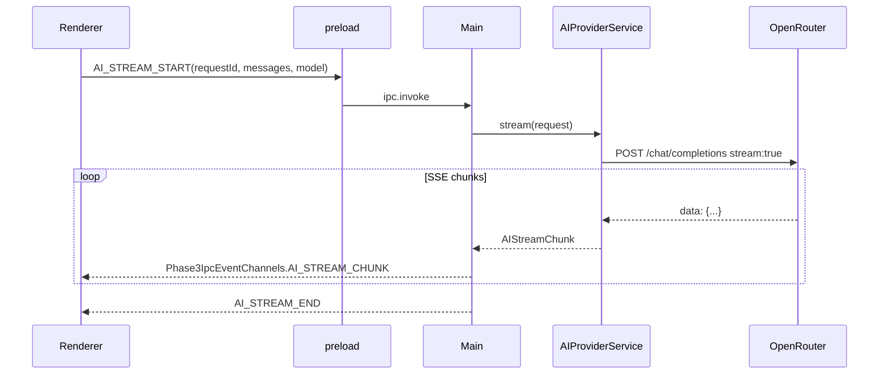

# AI 集成 — 快速启动

> 分支：3-ai-integration
> 创建日期：2026-03-25

## 前置条件

### 已有基础（Phase 1 / Phase 2 已完成）

- Monorepo（`packages/core`、`services`、`api`、`app` + `extensions/`）
- `TerminalService`、多标签终端、`TerminalView`（xterm.js）
- Extension API、`ext-terminal`、`ext-ssh` 等内置扩展注册范式
- IPC Bridge、`ISecretStore`（keytar + 降级）
- React + Zustand GUI Shell

### 账号与密钥

- 在 [OpenRouter](https://openrouter.ai/) 注册并创建 API Key
- 首次启动后在应用设置中写入密钥（存入系统 Keychain，不明文写入 JSON）

## 建议包结构（实现参考）

```
packages/services/src/
├── ai/
│   ├── ai-provider-service.ts      # IAIProviderService 实现
│   ├── openrouter-provider.ts      # OpenRouterProvider
│   ├── sse-parser.ts               # SSE → AIStreamChunk
│   ├── conversation-store.ts       # ConversationStore 文件实现
│   ├── ai-settings-store.ts      # settings.json 读写
│   ├── context-collector.ts        # AICommandContext 装配
│   ├── pipeline/
│   │   ├── pipeline-engine.ts      # PipelineEngine 实现
│   │   └── ai-command-pipeline.ts  # 内置步骤注册
│   └── __tests__/
│       ├── openrouter-provider.test.ts
│       ├── pipeline-engine.test.ts
│       └── conversation-store.test.ts
└── ...

packages/api/src/ipc/
├── channels.ts                     # 合并 Phase3IpcChannels / Events
└── types.ts                        # IPC DTO（对齐 contracts）

extensions/ext-ai/
├── package.json
├── src/
│   ├── index.ts                    # activate: commands + sidebar view
│   └── __tests__/index.test.ts

packages/app/src/renderer/src/
├── components/ai/
│   ├── AiSidebarPanel.tsx
│   ├── AiMessageList.tsx
│   └── AiSettingsForm.tsx
├── stores/ai-store.ts
└── ...

packages/app/src/renderer/src/components/terminal/
└── TerminalView.tsx                # 内联 ? 模式钩子（扩展）
```

## 数据流概览

### 侧边栏对话（流式）



### 终端内联 `? ` → 命令预览 → PTY

1. `TerminalView` 状态机捕获 `? ` 后的自然语言，不写入 PTY。
2. Renderer 调用 `AI_GENERATE_COMMAND`（或 `AI_COMPLETE`）并附带 `AICommandContext`。
3. Main 侧 `PipelineEngine.execute(aiCommandPipeline, input)` 返回 `ParsedCommandResult`。
4. 覆盖层展示 `primary` 命令；用户 Enter → `terminal.write` 到当前 `sessionId`；Esc → 退出内联状态。

### 上下文注入

1. UI 持有 `activeSessionId`。
2. Main 侧 `AI_CONTEXT_GET` 从 `TerminalService` 会话元数据与环形缓冲组装 `AICommandContext`。
3. 所有 AI 请求在构造 `AICompletionRequest` 时附加 `context`。

## 本地开发检查清单

1. 配置 `OPENROUTER_API_KEY`（或通过 UI 写入 Keychain）。
2. 在设置中选择模型（依赖 `AI_LIST_MODELS` 缓存或默认列表）。
3. 打开终端输入 `? list files in current directory` 验证内联路径。
4. 打开 AI 侧边栏验证多轮对话与持久化（`~/.terminalmind/ai/` 出现文件）。
5. 运行 `pnpm test` 覆盖 `services` 层 AI 模块。

## 相关文档

- 功能规约：`spec.md`
- 数据模型：`data-model.md`
- 契约：`contracts/ai-service.ts`、`contracts/pipeline-engine.ts`、`contracts/ipc-channels.ts`
- 任务分解：`tasks.md`
