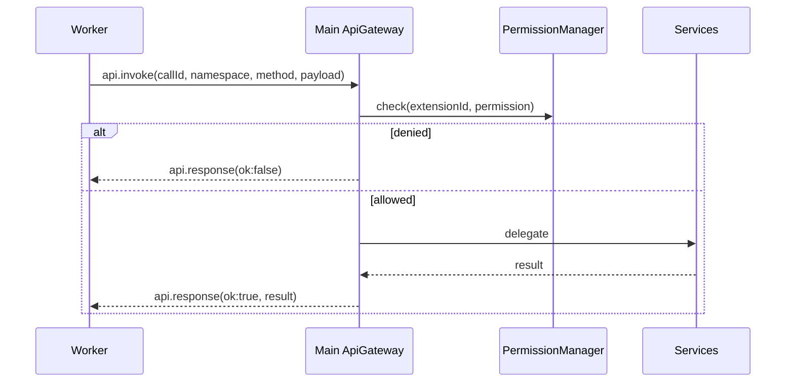

# 插件系统与市场 — 快速启动

> 分支：4-plugin-system  
> 创建日期：2026-03-25

## 前置条件

### 已有基础（Phase 1–3）

- Electron + React + TypeScript 应用与 `packages/services` 服务层  
- 内置扩展：`ext-terminal`、`ext-ssh`、`ext-sftp`、`ext-connections`、`ext-ai`  
- `ExtensionHost`（主进程路径）、部分 `TerminalMindAPI` 命名空间  
- IPC Bridge、EventBus、AI 与 Pipeline 实现  

### 环境

- Node.js 18+（`worker_threads`、`fetch` 可用）  
- 可访问 GitHub（拉取索引与 Release 资产）  

## 建议目录布局（实现参考）

```
~/.terminalmind/
├── extensions/
│   ├── installed.json
│   ├── permissions.json
│   └── <extensionId>/
│       └── <version or flat>/
│           ├── package.json
│           └── dist/
└── cache/
    └── registry-index.json

packages/services/src/
├── extension-host/
│   ├── extension-host.ts           # IExtensionHost 增强
│   ├── worker-extension-host.ts    # IWorkerExtensionHost
│   ├── worker-bootstrap.ts
│   ├── api-gateway.ts              # MessagePort → 服务
│   └── __tests__/
├── permissions/
│   ├── permission-manager.ts
│   └── __tests__/
├── marketplace/
│   ├── marketplace-service.ts
│   ├── registry-client.ts
│   └── __tests__/

packages/api/src/
├── extension-api.ts                # 同步 TerminalMindAPI 十命名空间类型
└── ipc/
    ├── channels.ts                 # 合并 Phase4IpcChannels
    └── types.ts                    # DTO

packages/app/src/
├── main/ipc-handlers.ts            # Phase 4 handlers
├── preload/index.ts
└── renderer/src/components/marketplace/
    ├── MarketplacePanel.tsx
    ├── ExtensionDetailsView.tsx
    └── PermissionPromptModal.tsx

tools/cli/
└── create-extension.ts             # terminalmind create-extension
```

## Registry 仓库示例结构（公开 GitHub）

```
terminalmind-registry/
├── registry-index.json    # RegistryIndex
└── README.md              # 发布流程说明
```

Release 资产：`my-ext-1.0.0.tgz`（`integrity` 写入索引对应版本）。

## 消息流（Worker 扩展调用 API）



## 手动验收清单（MVP）

1. 配置 Registry URL 指向测试索引，执行「刷新索引」成功。  
2. 搜索关键字能返回条目；打开详情显示版本列表与 `integrity` 信息（可折叠）。  
3. 安装扩展：进度事件到达；`~/.terminalmind/extensions/` 出现对应目录；`installed.json` 更新。  
4. 篡改 tarball 或错误哈希时安装失败并提示。  
5. 扩展首次调用 `ai.invoke` 等敏感 API 触发权限对话框；允许后 `check` 为 true；拒绝后调用失败。  
6. 强制 Worker 崩溃：主窗口仍可操作；扩展显示错误状态。  
7. 卸载扩展：目录删除、命令/视图注销。  
8. 运行 `terminalmind create-extension demo` 生成工程并可构建。  

## 相关文档

- [spec.md](./spec.md) — 功能规约  
- [data-model.md](./data-model.md) — 数据模型  
- [contracts/](./contracts/) — TypeScript 契约  
